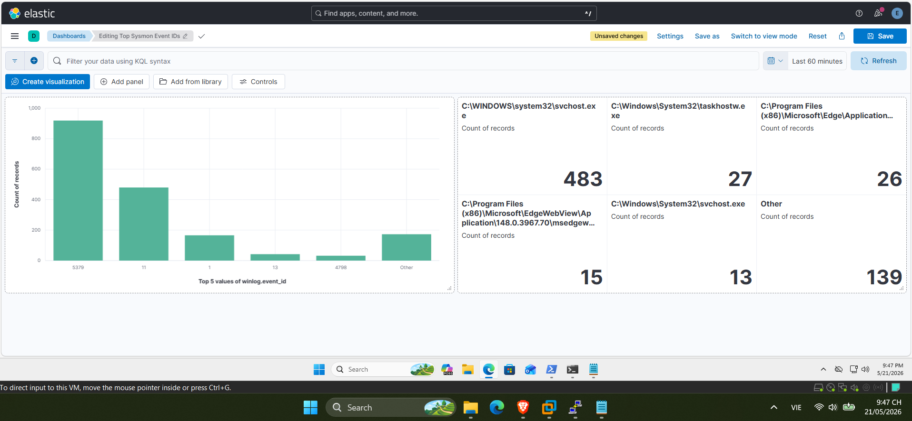
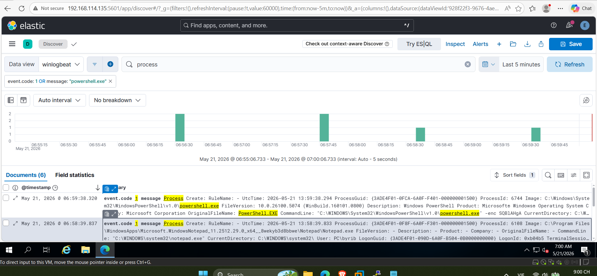
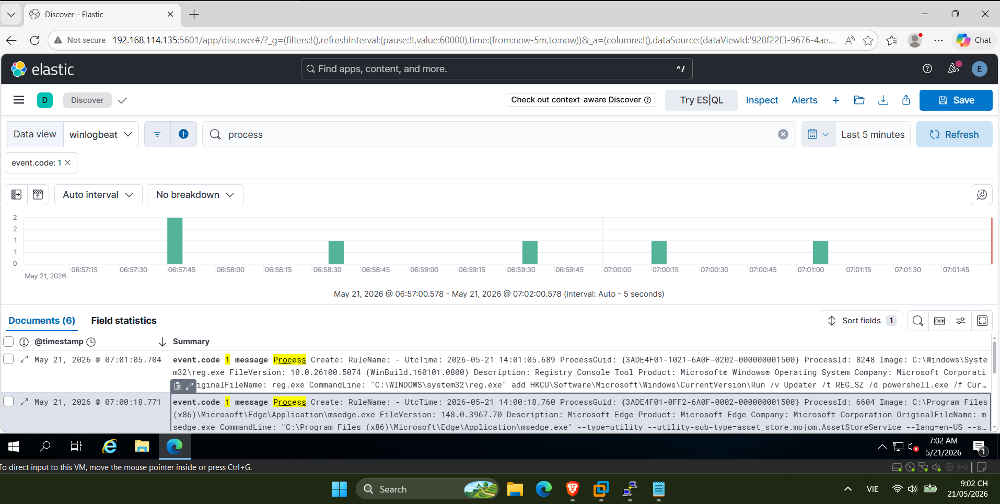
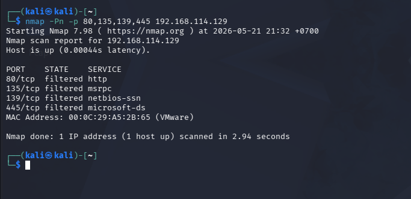

# SOC Automation & Threat Hunting Home Lab (v1)

A hands-on Security Operations Center (SOC) home lab focused on building an end-to-end log ingestion pipeline, simulating common adversary behaviors, and creating detection mechanisms using the Elastic Stack (ELK) and Sysmon.

## Architecture & Component Status
[ Windows 11 Endpoint ] (Sysmon)
│
▼ (Log Collection)
[ Winlogbeat ]
│
▼ (Log Ingestion via Network)
[ Ubuntu Server: ELK Stack ] (Elasticsearch ◄─► Kibana)
│
▼ (Analysis)
[ Threat Hunting & Dashboards ]


| Component / Feature | Status | Details |
| :--- | :---: | :--- |
| **Ubuntu Server (ELK Stack)** | ✅ Active | Centralized SIEM engine hosting Elasticsearch & Kibana |
| **Sysmon Installation** | ✅ Active | Advanced endpoint monitoring on Windows 11 target |
| **Winlogbeat Pipeline** | ✅ Active | Shipped Winlogbeat logs successfully over the network |
| **PowerShell Evasion Detection** | ✅ Active | Detected `-enc` (Encoded Command) executions |
| **Persistence Detection** | ✅ Active | Caught Registry Run Key modifications via `reg.exe` |
| **Reconnaissance Detection** | ✅ Active | Monitored incoming network scanning activity (`Nmap`) |
| **Dashboard Visualization** | ✅ Active | Created custom visualizations for Top Sysmon Event IDs |

---

## 📊 SIEM Dashboards & Threat Hunting Visualizations

### SOC Analytics Dashboard

*Custom Kibana dashboard mapping out top Sysmon events, process creations, and potential alert spikes within the environment.*

---

## 🛠️ Attack Simulation & Detection Playbook

### 1. PowerShell Encoded Command (Defense Evasion)
* **Adversary Behavior:** Attackers use Base64 encoded commands to bypass legacy command-line logging and obfuscate malicious scripts.
* **Simulation Execution:**
    ```powershell
    powershell.exe -enc SQBlAHgA
    ```
* **SIEM Detection:**

*Hunting for `event.code: 1` (Process Creation) where `process.command_line` contains obfuscation flags like `-enc` targeting the execution of suspicious strings.*

### 2. Registry Run Key Persistence (Persistence)
* **Adversary Behavior:** Establishing persistence to maintain access across reboots by abusing Windows Run registry keys.
* **Simulation Execution:**
    ```powershell
    reg add HKCU\Software\Microsoft\Windows\CurrentVersion\Run /v Updater /t REG_SZ /d "powershell.exe" /f
    ```
* **SIEM Detection:**

*Caught Sysmon `EventID: 1` or `EventID: 13` (RegistryEvent) tracking standard CLI tools (`reg.exe`) interacting with critical paths like `\\CurrentVersion\\Run`.*

### 3. Network Reconnaissance (Discovery)
* **Adversary Behavior:** Network scanning to map out active hosts and open ports.
* **Simulation Execution (from Kali Linux):**
    ```bash
    nmap -Pn -p 80,135,139,445 192.168.114.129
    ```
* **SIEM Detection:**

*Monitored Sysmon `EventID: 3` (Network Connection) logs for quick, sequential inbound connections to network management ports from an external machine.*

---

## 🎯 MITRE ATT&CK® Mapping

| Tactic | Technique | Sysmon Event ID | Detection Rule / Logic |
| :--- | :--- | :---: | :--- |
| **Discovery (TA0007)** | T1046 - Network Service Discovery | `3` | Rapid inbound TCP connection spikes from single source |
| **Defense Evasion (TA0005)** | T1027 - Obfuscated Files or Information | `1` | `process.command_line` contains `-enc` or `*powershell*` obfuscation |
| **Persistence (TA0003)** | T1547.001 - Registry Run Keys / Startup Folder | `1` / `13` | Target image `reg.exe` modifying `*\\CurrentVersion\\Run*` |

---

## 📈 Future Improvements
* [ ] Implement Windows Defender Alert integration into Elastic SIEM.
* [ ] Deploy **Elastic Agent** with Fleet Server for centralized endpoint management.
* [ ] Integrate an open-source Threat Intelligence feed (e.g., MISP) to enrich incoming IP data.
* [ ] Write automated Sigma Rules based on the discovered hunting patterns.
